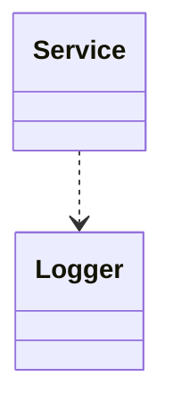
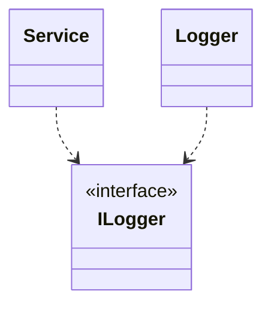

# Dependency Injection in NestJS

[Dependency injection in Angular](https://angular.io/guide/dependency-injection)

[Providers' DI](https://docs.nestjs.com/providers#dependency-injection)

## 

## Recap Dependency Injection

`Dependency injection` is one form of the broader technique of `inversion of control` (the `I` in `S.O.L.I.D`).

Extract Interface

